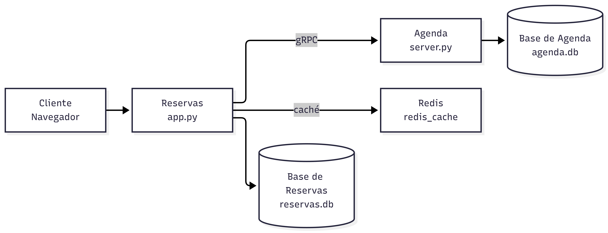

# Sistema de Gestión de Clínica Veterinaria — VidaAnimal



Cada servicio tiene **su propia base de datos**; la integración entre
ellos ocurre solo por gRPC. Las dos bases son **archivos SQLite**
guardados en volúmenes de Docker, así que no hay servidores de base
de datos que instalar ni mantener. Redis es un **tercer
contenedor**, pero no es una base de datos: es una caché en memoria
que se puede borrar sin perder nada (ver *Idempotencia y caché* más
abajo).

## Cómo levantar todo

```bash
docker compose up --build
```

| Servicio          | Acceso                          |
|-------------------|---------------------------------|
| Interfaz web + API| http://localhost:5000           |
| Swagger UI        | http://localhost:5000/v1/docs   |
| Agenda (gRPC)     | solo dentro de la red de Docker |
| Redis (caché)     | solo dentro de la red de Docker |


También hay una **colección de Postman** con las pruebas de la API
(`postman/VidaAnimal_Reservas.postman_collection.json`)

Las pruebas se pasan datos de una a otra (la 201 de dueños guarda
`id_dueno`, la 201 de bloques guarda `id_bloque` por disponibilidad y
la 201 de reservas guarda `id_reserva`), así que **el orden importa**.
Para que pasen las 137 aserciones hay que correr la colección en
**tres pasos**, porque la carpeta 6 necesita Agenda apagado y la
carpeta 7 necesita Agenda encendido:

```bash
docker compose down -v && docker compose up --build   # desde datos limpios
```

| Paso | Qué hacer | Por qué |
|---|---|---|
| 1 | En Postman, correr las carpetas **0 a 5** | Agenda está arriba: dan 200/201/400/401/404/405/409/415 |
| 2 | `docker compose stop agenda`, poner `agenda_caida` en `si` y correr la **carpeta 6** | con Agenda abajo, las tres rutas que dependen de él dan 503 |
| 3 | `docker compose start agenda` y correr la **carpeta 7** | la cancelación necesita Agenda para liberar el cupo |

> La carpeta 6 se salta sola (sin fallar la corrida) mientras
> `agenda_caida` siga en `no`, así que un **Run** normal sobre la
> colección completa no la rompe: corre 29 peticiones y 124 aserciones.
>
> Ojo con el paso 2: no se puede correr la carpeta 6 encima de una
> corrida anterior, porque su prueba de `DELETE` necesita una reserva
> **activa** y, si ya se canceló, la API responde 409 en vez de 503.
> Por eso la carpeta 6 va antes que la 7.

> La primera vez que arranca, cada servicio crea su archivo SQLite y sus
> tablas (`db.inicializar()`); Agenda además carga los datos de ejemplo
> de `sql/agenda_seed.sql` **solo si la base está vacía**.
> Los archivos viven en los volúmenes `reservas_data` y `agenda_data`,
> así que los datos sobreviven a `docker compose down` y a
> `docker compose up --build`.
> Para volver a los datos de ejemplo: `docker compose down -v` y levantar de nuevo.

## Probar la API

Puede probar los endpoints desde Swagger UI, use el botón **Authorize**
y pega la clave `clave-secreta-vet-2026` (se envía como header `X-API-Key`).

## Estructura

```
contracts/           agenda.proto + openapi.yaml (fuente única de verdad)
sql/                 .sql que db.inicializar() ejecuta al arrancar
  agenda.sql           tablas de Agenda
  agenda_seed.sql      datos de ejemplo (solo si la base está vacía)
  reservas.sql         tablas de Reservas
agenda/              servicio gRPC (Python)
  db.py                 conexión SQLite + inicializar()
  server.py             las 3 operaciones del .proto
reservas/            servicio Flask (API + interfaz web Bootstrap 5)
  app.py                 endpoints, error handlers, Swagger UI
  db.py                 conexión SQLite + inicializar()
  agenda_client.py       cliente gRPC hacia Agenda
  templates/index.html
  static/styles.css, static/app.js
docker-compose.yml   levanta todo con un solo comando
postman/             colección de Postman con las pruebas de la API
  VidaAnimal_Reservas.postman_collection.json
docs/adr/            los cuatro ADR (una decisión por archivo)
  001-dos-servicios-y-base-por-servicio.md
  002-rest-afuera-grpc-adentro.md
  003-versionado-y-evolucion-del-contrato.md
  004-fallos-de-agenda.md
```

## Requisitos opcionales: 

| # | Mejora | Dónde está |
|---|---|---|
| **O1** | **Caché con Redis** | `reservas/app.py` → `leer_bloques_cacheados()`, `guardar_bloques_cacheados()`, `olvidar_bloques()`, usadas en `listar_bloques()`, `crear_reserva()` y `cancelar_reserva()`. Redis corre como servicio `redis_cache` en Docker. |
| **O2** | **Idempotencia** | `reservas/app.py` → `crear_reserva()` lee la cabecera y consulta `leer_reserva_idempotente()`; si la clave ya se usó, responde `200` con la reserva ya creada. Se guarda con `guardar_reserva_idempotente()`. Detalle en *Idempotencia* más abajo. |
| **O3** | **HATEOAS**  | `reservas/app.py` → `obtener_reserva()` arma `_links` con `self` y `dueno`, y agrega `cancelar` (con su `metodo`) solo si la reserva sigue activa. El schema `_links` está declarado en `contracts/openapi.yaml`. Detalle en *HATEOAS* más abajo. |

## Uso de Herramientas de IA

* **Herramienta:** Se utilizó exclusivamente **OpenCode** como asistente conversacional de soporte tanto para la implementación como para la estructuración documental.

* **Metodología y alcance:** Bajo un enfoque guiado por contratos (*Contract-First*), el equipo diseñó la arquitectura, las interfaces (`contracts/agenda.proto`, `contracts/openapi.yaml`) y la lógica central en `reservas/app.py`. A partir de esta base, se empleó el asistente para agilizar la generación de código de los servicios, esquemas `sql/`, configuración de contenedores (`Dockerfile`, `docker-compose.yml`), interfaz web y colección de Postman. Asimismo, apoyó en el formateo preliminar de los cuatro ADR y de `informe.tex`, siendo todo validado e integrado por los integrantes.

